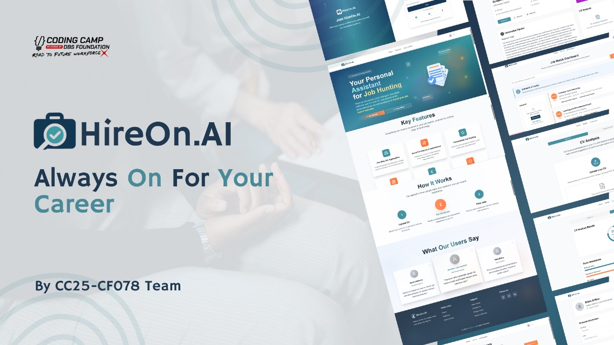
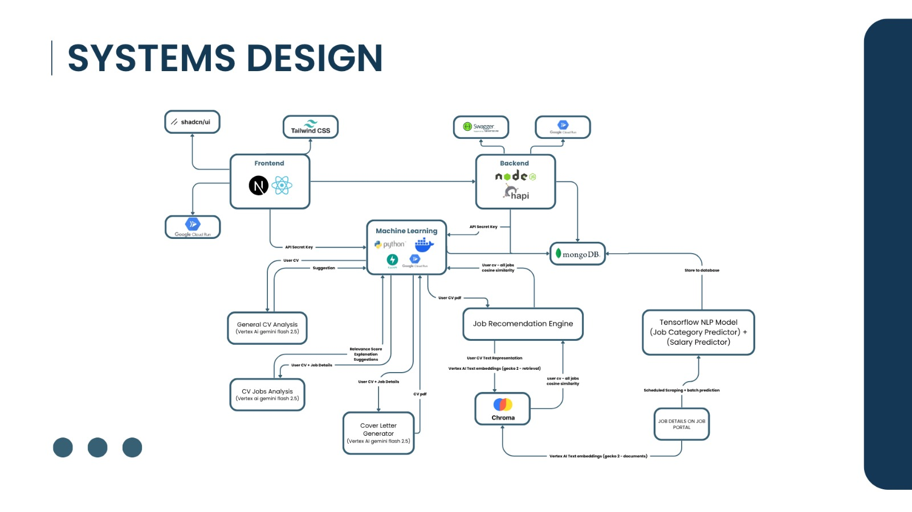

# **HireOn.AI**  
#### *Always On for Your Career*

An AI-powered platform designed to empower job seekers through intelligent, personalized career tools.  

© CC25 - CF078 | Coding Camp Capstone Team  
*Empowering People. Enhancing Potential.*

---

## Overview

**HireOn.AI** is an intelligent career platform built exclusively for **job seekers**, not recruiters. We empower you to stand out in a crowded job market by offering **AI-driven CV feedback**, **automatic cover letter generation**, and **personalized job recommendations**.

Unlike traditional job boards, we don’t just aggregate listings, we deeply understand your unique strengths and career goals, providing a truly personalized experience that accelerates your journey from application to opportunity. Because finding a job shouldn’t feel like a fulltime job — it should feel like your next big step.

## 📊 Background

According to [Statistics Indonesia (BPS), August 2024](https://data.goodstats.id/statistic/persentase-sarjana-pengangguran-di-ri-meningkat-dua-kali-lipat-selama-1-dekade-terakhir-9ah2d), **842,378 university graduates are unemployed**, making up **11.28%** of the total 7.47 million unemployed individuals in Indonesia. This highlights a critical gap: many **fresh graduates struggle** to align their skills and experience with industry demands, underscoring the urgent need for solutions that bridge this disconnect.

**Key challenges include:**
- Mismatch between degrees and job opportunities  
- Unstructured and unclear job listings  
- Career guidance that feels generic, not personal
- Inadequate support in crafting CVs and cover letters  
- Career switches by 60% of Indonesian workers, reflecting the need for adaptable pathways ([Jakpat, 2016](https://insight.jakpat.net/its-time-to-roll-survey-report-on-indonesians-switching-job-habit/))

## 💡 What We Offer

**HireOn.AI** isn't just another job platform, it’s your **AI-powered career partner**, crafted to navigate the real obstacles behind job mismatches. By combining breakthrough technology with sleek, user-friendly design, and a deep understanding of your journey, we make job hunting effortless, tailored, and impactful. With HireOn.AI, you don’t just find jobs — you **discover the right path to unlock your true opportunity**.

### ✨ Generative AI Services

- **CV Job Analysis**: Analyzes a candidate's CV against job details to:
  - Calculate a relevance score between the CV and job
  - Identify skill matches and gaps
  - Provide personalized improvement suggestions
  - Highlight strengths and areas for development

- **Cover Letter Generator**: Automatically generates personalized cover letters based on:
  - Candidate's CV content
  - Job description and requirements
  - Outputs as a professionally formatted PDF

- **General CV Analysis**: Provides comprehensive evaluation of a CV without job context:
  - Overall CV score and section-by-section breakdown
  - Highlights CV strengths and achievements
  - Identifies areas for improvement
  - Analyzes each CV section (work experience, education, skills, achievements)

### 🔗 Recommendation Engine

- **Job Recommendations**: Provides personalized job recommendations based on:
  - Semantic understanding of CV content
  - Job title and description matching
  - Similarity scoring and ranking

- **CV Embeddings**: Stores and retrieves vector embeddings of user CVs for efficient similarity searching

### 🖥️ Seamless, Smart, and User-Friendly

- **Apply Smarter, Not Harder:** One-click applications straight from your dashboard. Relevant jobs, zero tab-hopping.
- **Curated Listings, AI-Filtered:** We aggregate jobs across platforms and serve only the most relevant roles — ranked, contextualized, and tailored to you.
- **Minimal by Design, Powerful in Action:** Every screen is clean, consistent, responsive, and accessible. Whether you're on desktop or mobile, the experience is smooth, intuitive, and distraction-free.

## 📁 Project Documentations

Explore the core **components powering HireOn.AI** across these dedicated repositories. Each one focuses on a crucial part of our platform.

| Repository       | Description                                                                                                   | Link                                                      |
|------------------|---------------------------------------------------------------------------------------------------------------|-----------------------------------------------------------|
| Machine Learning | Home to our AI models and algorithms that power CV analysis, cover letter generation, and job matching.       | [Machine Learning Repo](https://github.com/hireonai/ml-services)   |
| Frontend         | Contains the sleek, responsive UI built with Next.js and shadcn/ui, designed for an intuitive user experience. | [Frontend Repo](https://github.com/hireonai/frontend-hireonai)      |
| Backend          | The backbone RESTful API built with HapiJS, handling authentication, data processing, and AI service integration. | [Backend Repo](https://github.com/hireonai/backend-hireonai)        |

## 🏗️ System Design

This system design outlines the **architecture of HireOn.AI**, the frontend combining a React + Next.js, styled with Tailwind CSS and Shadcn UI, deployed via Google Cloud Run. The backend, built with Node.js + Hapi.js, exposes secured APIs using JWT tokens and manages data storage with MongoDB Atlas and Google Cloud Storage (Object Storage). Core ML services are containerized in Docker and served through Google Cloud Platform, using Vertex AI Gemini Flash 2.5 for CV analysis, job matching, and personalized cover letter generation. The job recommendation engine utilizes Chroma vector search with Gecko-2 embeddings for high-precision semantic matching. Job data is enriched through scheduled scraping, categorized jobs and salary-estimated via a TensorFlow NLP model. This processed data is then used by downstream services to improve relevance and personalization.

## 👥 Our Team — CC25-CF078

We are a cross-university team under the **Coding Camp 2025 powered by DBS Foundation** program, committed to addressing graduate unemployment through the use of smart technologies.

| Name | Role | Institution | Profile |
|------|------|-------------|---------|
| Gusti Ayu Putu Erika Erlina | Machine Learning Engineer | Universitas Terbuka | [LinkedIn](https://www.linkedin.com/in/gusti-ayu-putu-erika-erlina-2105a5219/) / [GitHub](https://github.com/eriksszva) |
| Evan Hanif Widiatama | Machine Learning Engineer | Universitas Sebelas Maret | [LinkedIn](https://www.linkedin.com/in/evanhfw/) / [GitHub](https://github.com/evanhfw) |
| Ika Widiyanti | Machine Learning Engineer | STT Terpadu Nurul Fikri | [LinkedIn](https://www.linkedin.com/in/ika-widiyanti-432a18251/) / [GitHub](https://github.com/IKAWIDIYANTI) |
| Ghiyats Ibnu Syahied | Fullstack Developer | Universitas Gunadarma | [LinkedIn](https://www.linkedin.com/in/ghiyatsyhd/) / [GitHub](https://github.com/ghiyatssyahied) |
| Argya Arya Putri | Fullstack Developer | STT Terpadu Nurul Fikri | [LinkedIn](https://www.linkedin.com/in/argyaaryaputri/) / [GitHub](https://github.com/giAptri) |
| M. Fikri Ansari | Fullstack Developer | Universitas Terbuka | [LinkedIn](https://www.linkedin.com/in/m-fikri-ansari/) / [GitHub](https://github.com/lotusCupcake) |

## 🚀 Our Vision

We believe that every individual has the potential to thrive when supported by an adaptive and intelligent job-matching system. Through this project, we aim to contribute to building a **more efficient, inclusive, and data-driven employment ecosystem**.